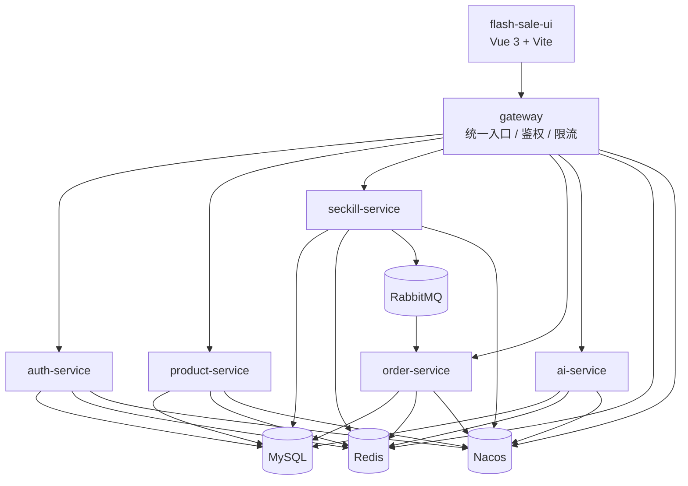

# Flash Sale System

一个以“普通商城 + 秒杀活动 + AI 助手”为核心场景的微服务练手项目，适合用于展示商城主链路、秒杀高并发处理思路，以及 AI 商品问答接入方式。

## 项目简介

当前仓库已经具备可联调、可演示的前后端闭环能力，覆盖 3 条核心业务线：

- 普通商品链路：商品浏览、购物车、结算、下单、支付、取消
- 秒杀链路：秒杀商品浏览、抢购、结果轮询、异步建单、支付、取消
- AI 链路：商品问答、会话管理、候选商品解析、知识库同步

仓库包含两个子项目：

- `flash-sale-serve`：Spring Cloud 微服务后端
- `flash-sale-ui`：Vue 3 商城前端

## 功能亮点

### 用户与账户

- 登录、注册、退出登录
- 获取当前用户信息
- 修改密码
- 收货地址增删改查
- 设置默认收货地址

### 普通商城

- 商品列表与详情
- 商品名搜索
- 分类筛选与分类关键词命中搜索
- 购物车增删改查
- 普通订单创建
- 普通订单列表、详情、模拟支付、取消、支付状态查询

### 秒杀场景

- 秒杀商品列表与详情
- Redis 库存预热
- Redis + Lua 原子校验与预扣
- RabbitMQ 异步建单
- 秒杀结果轮询
- 秒杀订单列表、详情、模拟支付、取消、支付状态查询

### AI 助手

- 商品问答
- 会话列表、详情、删除
- 候选商品解析
- 知识库同步、同步任务查询、知识库统计

## 系统架构



## 项目结构

```text
flash-sale-system
├─ flash-sale-serve
│  ├─ ai-service
│  ├─ auth-service
│  ├─ common
│  ├─ gateway
│  ├─ order-service
│  ├─ product-service
│  ├─ seckill-service
│  └─ docs
├─ flash-sale-ui
├─ README.md
└─ 根目录专题文档
```

## 后端服务与默认端口

| 服务 | 端口 | 说明 |
| --- | --- | --- |
| `gateway` | `8080` | 统一入口、鉴权、限流、Swagger 聚合 |
| `seckill-service` | `8081` | 秒杀商品查询、秒杀请求、秒杀结果 |
| `order-service` | `8082` | 普通订单与秒杀订单查询、支付、取消 |
| `auth-service` | `8083` | 登录、注册、用户信息、地址管理 |
| `product-service` | `8084` | 普通商品、购物车、普通下单入口 |
| `ai-service` | `8085` | AI 问答、会话、知识库 |

## 前端页面

当前前端主要页面包括：

- 登录 / 注册
- 商城首页
- 秒杀页
- 购物车
- AI 助手
- 结算页
- 订单中心
- 账户信息
- 密码安全

前端当前采用 `Hash Router`，主要路由如下：

- `/#/login`
- `/#/register`
- `/#/app/home`
- `/#/app/flash`
- `/#/app/cart`
- `/#/app/assistant`
- `/#/app/profile`
- `/#/app/profile/orders`
- `/#/app/profile/account`
- `/#/app/profile/security`
- `/#/checkout`

## 技术栈

### 后端

- Java 17
- Spring Boot 3.2.5
- Spring Cloud 2023.0.1
- Spring Cloud Alibaba 2023.0.1.0
- Spring Cloud Gateway
- OpenFeign
- MyBatis
- MySQL
- Redis
- RabbitMQ
- Nacos
- SpringDoc OpenAPI

### 前端

- Vue 3
- Vue Router 4
- Vite 6
- Element Plus
- Axios

## 快速开始

### 1. 准备基础设施

先启动以下组件：

- MySQL
- Redis
- RabbitMQ
- Nacos

### 2. 初始化数据库

SQL 文件位于：

- `flash-sale-serve/docs/sql`

建议至少执行：

- 初始化基础表结构
- 导入普通商品与秒杀商品示例数据
- 执行后续字段和索引补丁脚本

### 3. 初始化 Nacos 配置

相关文档位于：

- `flash-sale-serve/docs/nacos-config-guide.md`
- `flash-sale-serve/docs/nacos-templates/README.md`

推荐导入的数据集：

- `flash-sale-common.yaml`
- `flash-sale-jwt.yaml`
- `flash-sale-mysql.yaml`
- `flash-sale-redis.yaml`
- `flash-sale-rabbitmq.yaml`
- `auth-service.yaml`
- `gateway.yaml`
- `product-service.yaml`
- `order-service.yaml`
- `seckill-service.yaml`
- `ai-service.yaml`

### 4. 启动后端服务

建议顺序：

1. `auth-service`
2. `product-service`
3. `seckill-service`
4. `order-service`
5. `ai-service`
6. `gateway`

说明：

- 当前仓库没有 `mvnw`，请使用本机 Maven 或 IDE 自带 Maven
- 配置采用 `application.yml + application-local.yml + Nacos` 的分层方式

### 5. 启动前端

进入 `flash-sale-ui` 目录后执行：

```bash
npm install
npm run dev
```

## 默认访问地址

- 前端：`http://localhost:5173`
- 网关：`http://localhost:8080`
- Swagger 聚合：`http://localhost:8080/swagger-ui.html`
- AI 服务 Swagger：`http://localhost:8085/swagger-ui.html`

## 最近修复记录

近期已完成一组和 Redis 正确性相关的修复：

### 1. 秒杀重复消息库存误扣

- 修复了秒杀重复消息命中唯一索引时，数据库库存可能被多扣一次的问题
- 当前重复消费会优先回补本次事务中的库存扣减，再回填已有订单状态

### 2. AI 会话上下文缓存 miss 失真

- 修复了 AI 会话上下文在 Redis miss 时被误判为空上下文的问题
- 当前缓存 miss 会正确回源数据库，不再直接丢失多轮会话语义

### 3. 秒杀补偿改为 Lua 原子回滚

- 将秒杀失败补偿、超时补偿、订单取消后的 Redis 回补统一收敛为 Lua 原子操作
- 避免 `SREM + INCR` 分步执行带来的半状态问题

## 文档索引

根目录文档已经按职责拆分：

- [架构与接口规范](./Flash-Sale-System架构与接口规范.md)
- [前后端交互规范](./前后端交互规范.md)
- [已实现技术栈解析与使用说明](./已实现技术栈解析与使用说明.md)
- [前端完整化待补充后端接口清单](./前端完整化待补充后端接口清单.md)
- [AI-Service 优化方向](./ai-service-优化方向.md)
- [当前阶段规划与后续路线](./planning.md)
- [文档审计记录](./REVIEW_AUDIT.md)

后端子目录文档位于：

- [后端文档入口](./flash-sale-serve/docs/README.md)

## 当前说明

- Windows PowerShell 直接查看中文 Markdown 时可能出现乱码，这通常是终端编码显示问题，不代表文件内容错误。
- 前端标准联调入口应优先走网关，不建议把单个服务直连作为默认使用方式。
- 如果你准备把这个仓库提交到 GitHub，建议同时维护根目录文档和 `flash-sale-serve/docs`，避免入口文档与后端专题文档口径分裂。
